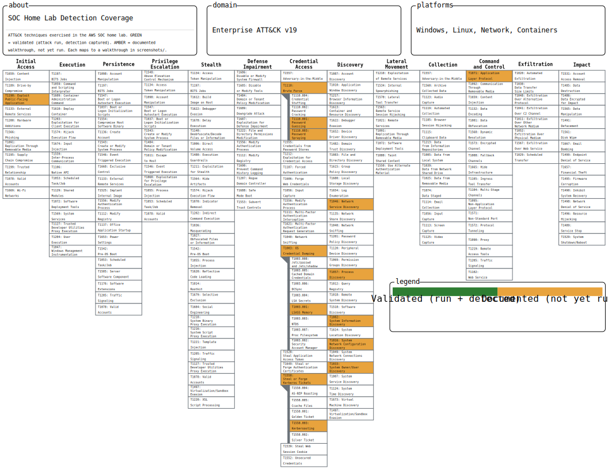

# SOC Analyst Home Lab on AWS

A production-style **Security Operations Center (SOC)** lab built entirely on AWS — console-first, no Terraform — to practice the full detection-and-response workflow end to end: network and host-based detection, automated alerting, case management, threat enrichment, adversary emulation, and vulnerability management.

> Every component was deployed and integrated by hand to understand how the pieces actually connect — including the real-world troubleshooting a production deployment demands. The [Challenges & Solutions](#challenges--solutions) section is where most of the learning lives.

---

## Table of Contents
- [Architecture](#architecture)
- [Detection & Response Pipeline](#detection--response-pipeline)
- [Tech Stack](#tech-stack)
- [Components](#components)
- [Key Integrations](#key-integrations)
- [Detection Walkthroughs](#detection-walkthroughs)
- [Challenges & Solutions](#challenges--solutions)
- [Skills Demonstrated](#skills-demonstrated)
- [Cost Management](#cost-management)
- [Repository Structure](#repository-structure)
- [Future Improvements](#future-improvements)

---

## Architecture


A single-region VPC (`10.0.0.0/16`) segmented into purpose-built subnets, with a bastion for administrative access and a NAT for private outbound traffic. All workload subnets are private (no public IPs); access is via the bastion using SSH local-forward and SOCKS tunnels.

| Subnet | CIDR | Hosts |
|---|---|---|
| **public** | `10.0.1.0/24` | Bastion, NAT |
| **secops** | `10.0.10.0/24` | Wazuh manager, Security Onion, TheHive + Cortex, Nessus |
| **attack** | `10.0.20.0/24` | Kali Linux |
| **ad** | `10.0.30.0/24` | Domain Controller, Windows clients |
| **vuln** | `10.0.40.0/24` | Vulnerable applications host (Docker) |

**Security groups** enforce the perimeter: SSH to the bastion is restricted to a known IP; internal traffic is permitted within the VPC; web UIs are reached only through tunnels.

---

## Detection & Response Pipeline

The core data flow that turns a collection of tools into a working SOC:

```
   Attacker (Kali / Caldera)
            │  attack / ATT&CK emulation
            ▼
   Targets (vuln host, AD, Windows clients)
            │
            ├─►  Wazuh agents + Sysmon ──►  Wazuh Manager ──►  auto-alert ──►  TheHive (case)
            │                                                                      │
            └─►  VPC Traffic Mirroring ──►  Security Onion                         ▼
                                            (Suricata / Zeek / PCAP)          Cortex (enrichment)
```

1. **Generate activity** — attacks from Kali or scripted ATT&CK techniques from Caldera hit the targets.
2. **Detect** — Wazuh + Sysmon capture host/endpoint telemetry; Security Onion captures network telemetry via VPC traffic mirroring.
3. **Alert** — Wazuh alerts above a configurable level threshold are automatically pushed into TheHive as alerts.
4. **Investigate & enrich** — an analyst promotes alerts to cases and runs observables through Cortex analyzers for enrichment.

The same attack is visible in **both** the host layer (Wazuh) and the network layer (Security Onion) — independent, complementary detection.

---

## Tech Stack

| Layer | Tool | Notes |
|---|---|---|
| SIEM / XDR (host) | **Wazuh 4.x** | Central manager + agents on all hosts |
| Endpoint telemetry | **Sysmon** | SwiftOnSecurity config, collected by Wazuh |
| NSM / IDS (network) | **Security Onion 2.4** | Suricata, Zeek, Stenographer (full PCAP) |
| Case management | **TheHive 5.7** | Alerts, cases, observables |
| Enrichment / analyzers | **Cortex 4.x** | 274 available analyzers (Dockerized) |
| Adversary emulation | **MITRE Caldera** | Sandcat agents, ATT&CK operations |
| Vulnerability scanning | **Nessus Essentials** | Authenticated network scans |
| Directory services | **Active Directory** | Windows Server 2022, domain `soc.lab` |
| Attack platform | **Kali Linux** | nmap, hydra, etc. |
| Vulnerable targets | **DVWA, OWASP Juice Shop, WebGoat, Metasploitable2** | Run as Docker containers |
| Cloud / infrastructure | **AWS** | VPC, EC2, Traffic Mirroring, NAT, Security Groups |

---

## Components

**Network foundation** — Segmented VPC with bastion access and NAT for private outbound. Security groups model a least-privilege-ish perimeter for a lab (external SSH locked to one IP, internal traffic allowed within the VPC).

**Wazuh** — Central manager (Marketplace AMI) with agents deployed across every host: Windows DC and clients (with Sysmon), Kali, and the Ubuntu vulnerable-apps host. Provides FIM, log analysis, SCA, and the alerting that feeds TheHive.

**Sysmon** — Deployed on Windows endpoints with the SwiftOnSecurity configuration for rich process, network, and registry telemetry; collected by the Wazuh agent via the `Microsoft-Windows-Sysmon/Operational` channel.

**Security Onion** — Self-installed (free) on Oracle Linux 9 for network security monitoring: Suricata (IDS), Zeek (protocol metadata), and full packet capture. Fed by AWS VPC Traffic Mirroring.

**Active Directory** — Windows Server 2022 promoted to the `soc.lab` forest, with domain-joined Windows clients — a realistic enterprise identity environment to attack and monitor.

**TheHive + Cortex** — TheHive 5.7 for incident case management, integrated with Cortex 4.x for automated observable enrichment via analyzers. Both run as Docker stacks on a shared secops host.

**Caldera** — MITRE Caldera with Sandcat agents on the endpoints for repeatable, scripted ATT&CK-based adversary emulation that exercises the detection pipeline.

**Nessus** — Nessus Essentials for authenticated and unauthenticated vulnerability scanning of the lab subnets.

**Vulnerable targets** — DVWA, OWASP Juice Shop, WebGoat, and Metasploitable2 run as containers on a single Ubuntu host, providing a rich attack surface and high-signal telemetry.

---

## Key Integrations

1. **Wazuh agents everywhere** — Windows (DC + clients) with Sysmon, Kali, and the Ubuntu vuln host all report to the central Wazuh manager.
2. **VPC Traffic Mirroring → Security Onion** — one mirror session per source ENI copies traffic (VXLAN over UDP 4789) to Security Onion's dedicated sniffing interface.
3. **Wazuh → TheHive** — a custom integration script (thehive4py **v2**) running on the Wazuh manager auto-creates TheHive alerts from Wazuh alerts above a level threshold, attaching observables (IPs) automatically.
4. **TheHive ↔ Cortex** — TheHive dispatches observables to Cortex analyzers (which run as Docker containers) and displays the enrichment results inline on cases.

---

## Detection Walkthroughs

Proof the lab actually catches real attacks. Each walkthrough runs a high-value attack against the lab's isolated targets and documents it end to end — **attack → detection → triage → mitigation** — mapped to MITRE ATT&CK, with screenshots from every layer of the stack. Full write-ups in [`attacks/`](attacks/).

| # | Attack | ATT&CK | Primary detection |
|---|---|---|---|
| 01 | [Network recon — Nmap scan](attacks/01-network-recon-nmap/) | T1046 / T1595 | Security Onion (Suricata) |
| 02 | [SSH brute force](attacks/02-ssh-brute-force/) | T1110.001 | Wazuh → TheHive → Cortex |
| 03 | [Web SQL injection (DVWA)](attacks/03-web-sql-injection-dvwa/) | T1190 / OWASP A03 | Wazuh (container logs) + Suricata |
| 04 | [vsftpd 2.3.4 backdoor RCE](attacks/04-vsftpd-backdoor-rce/) | T1190 (CVE-2011-2523) | Security Onion + Wazuh |
| 05 | [Samba usermap_script RCE](attacks/05-samba-usermap-rce/) | T1190 (CVE-2007-2447) | Security Onion + Wazuh |
| 06 | [AD password spray + Kerberoasting](attacks/06-ad-password-spray-kerberoast/) | T1110.003 / T1558.003 | Windows events + Sysmon → Wazuh |
| 07 | [LSASS credential dumping](attacks/07-credential-dumping-lsass/) | T1003.001 | Sysmon EID 10 → Wazuh |
| 08 | [Caldera adversary emulation](attacks/08-caldera-adversary-emulation/) | T1071 + chain | Sysmon/Wazuh + Security Onion |

**Coverage map:** the techniques above are visualized as a [MITRE ATT&CK Navigator layer](attack-navigator/) — import the JSON to see the lab's detection coverage on the ATT&CK matrix at a glance.



---

## Challenges & Solutions

The build surfaced a series of non-obvious problems. Each one is a small case study in reading errors and reasoning to root cause.

### 1. Security Onion install failed on minimal Oracle Linux 9
**Problem:** `so-setup` aborted because the minimal OS image lacked `cron`, which cascaded into Salt master/minion handshake failures, a missing `salt` entry in `/etc/hosts`, and a minion ID that didn't match Security Onion's role-based `top.sls` ("No Top file or master_tops data matches found").
**Root cause:** A network install that aborts mid-run leaves core configuration (minion ID, top-file mapping, Salt keys, hosts entries) half-written — it can be hand-patched piece by piece, but the result is fragile.
**Fix:** Rebuilt the instance cleanly with `cronie` installed and enabled **before** running `so-setup`, removing the original failure trigger and letting the install complete fully.

### 2. TheHive Elasticsearch 401 after a Docker network connect
**Problem:** To let TheHive resolve the `cortex` hostname, its container was connected to Cortex's Docker network. TheHive then failed to boot with `401 Unauthorized` against `http://elasticsearch:9200`.
**Root cause:** A **hostname collision** — Cortex's Elasticsearch *service* is also aliased `elasticsearch` on that network, so TheHive began resolving `elasticsearch` to Cortex's ES (different credentials) instead of its own.
**Fix:** Reached Cortex over the **host IP and a published port** (`http://<host>:9001`) instead of a shared Docker network, eliminating the collision entirely.

### 3. TheHive 5 API version trap (Wazuh integration)
**Problem:** The widely-referenced Wazuh→TheHive integration scripts silently failed against TheHive 5.
**Root cause:** Those scripts target **thehive4py v1**, whose model classes don't work against TheHive 5's API.
**Fix:** Wrote the integration against **thehive4py v2** (import `TheHiveApi` from the package root; create alerts from dicts rather than v1 model objects).

### 4. Cortex dockerized analyzers failed with AccessDenied
**Problem:** Every analyzer job failed; the report showed `"input": null, "success": false`. The Cortex log revealed `java.nio.file.AccessDeniedException` creating `/tmp/cortex-jobs/cortex-job-...`.
**Root cause:** Cortex runs each analyzer as a separate Docker container and prepares a per-job folder — but it runs as a non-root user and couldn't create directories in the bind-mounted job directory.
**Fix:** `chmod 1777` on the host job directory (so Cortex can create job folders and the spawned analyzer containers can read/write them) and confirmed `docker_job_directory` pointed at the absolute host path so the analyzer containers mount the correct directory.

### 5. AWS VXLAN traffic mirroring
**Problem:** Security Onion needs the original packets, but AWS encapsulates mirrored traffic in VXLAN (UDP 4789).
**Fix:** Verified packets arriving on the sniff interface with `tcpdump` (confirming the AWS mirror path), then confirmed Suricata/Zeek auto-decode the standard VXLAN. Documented the `vxlan0` decapsulation-interface fallback for environments where the tools don't auto-decode.

### 6. Caldera agent blocked by Windows Defender (AMSI)
**Problem:** The Sandcat PowerShell deployment one-liner was blocked with `ScriptContainedMaliciousContent`. A folder exclusion didn't help.
**Root cause:** The block is at the **AMSI / script-content** level, not file scanning — path exclusions don't apply.
**Fix:** Disabled Tamper Protection (GUI) then real-time protection on the lab clients — appropriate for an emulation lab where the detection stack (Sysmon/Wazuh/Security Onion), not Defender, is the system under test. Sysmon still logs the agent's behavior.

### 7. Nessus skipping the Windows clients
**Problem:** Two Windows clients never appeared in scan results, even though they were listed as targets.
**Root cause:** Host discovery, **not** credentials — the Windows firewall blocked ICMP, so Nessus marked the hosts dead and skipped them (and would also have blocked the credentialed SMB/WMI checks).
**Fix:** Disabled the host firewall on the clients — safe in a private, security-group-gated subnet — which restored both discovery and authenticated scanning.

---

## Skills Demonstrated

- **Cloud security architecture** — VPC design, network segmentation, bastion/NAT patterns, security groups, VPC Traffic Mirroring
- **SIEM / XDR** — Wazuh deployment, multi-OS agent management, Sysmon instrumentation
- **Network security monitoring** — Security Onion (Suricata IDS, Zeek metadata, full PCAP)
- **SOAR-style automation** — automated Wazuh→TheHive alert ingestion
- **Threat intelligence enrichment** — Cortex analyzers and TheHive case workflow
- **Adversary emulation** — MITRE Caldera / ATT&CK operations
- **Vulnerability management** — authenticated Nessus scanning of Windows and Linux
- **Active Directory administration** — forest/domain setup, domain join, domain auth
- **Systems administration** — Linux and Windows, Docker, multi-container service orchestration
- **Troubleshooting & root-cause analysis** — across networking, containers, IAM/auth, and service configuration

---

## Cost Management

The lab runs ~10 EC2 instances; left on 24/7 it is expensive, with Security Onion the single largest driver. Practices used to keep cost down:
- Stop instances when not actively in use
- Single Availability Zone
- NAT instance instead of NAT gateway where appropriate
- Right-sized instances per workload
- Free self-installs over paid Marketplace AMIs (e.g., self-installed Security Onion)

> Trial licenses (TheHive Platinum, Security Onion) revert to free/community tiers on expiry — nothing breaks.

---

## Repository Structure

```
soc-homelab-aws/
├── README.md
├── diagrams/
│   └── architecture.png        # network / data-flow diagram
├── docs/                       # per-component build notes (reproducible from scratch)
│   ├── README.md               # index
│   ├── 01-network-foundation.md
│   ├── 02-vulnerable-targets-and-kali.md
│   ├── 03-wazuh.md
│   ├── 04-active-directory.md
│   ├── 05-security-onion.md
│   ├── 06-thehive-cortex.md
│   ├── 07-wazuh-thehive-integration.md
│   ├── 08-caldera.md
│   └── 09-nessus.md
├── configs/                    # sanitized config files (no secrets)
│   ├── README.md               # index + "where each file goes"
│   ├── docker/ wazuh/ thehive/ cortex/
│   └── security-onion/ active-directory/ caldera/
├── attacks/                # attack walkthroughs (attack → detection → mitigation)
│   ├── README.md               # index of all eight, with ATT&CK mapping
│   └── 01-...  →  08-...        # one folder per attack + its screenshots
└── attack-navigator/           # MITRE ATT&CK Navigator coverage layer
    ├── README.md
    └── soc-lab-coverage.json
```

---

## Future Improvements

- **Infrastructure as Code** — rebuild the lab reproducibly with Terraform
- **MISP** — threat-intel platform, wired into Cortex/TheHive
- **Shuffle SOAR** — richer automation and response playbooks
- **More Cortex analyzers** — add free API keys (VirusTotal, AbuseIPDB, GreyNoise) for real IOC enrichment
- **Detection engineering** — custom Wazuh rules, Sigma, Suricata rule tuning
- **AWS-native detection** — GuardDuty and CloudTrail forwarded into Wazuh

---

*Built as a hands-on learning project to understand SOC tooling and integration from the ground up.*
